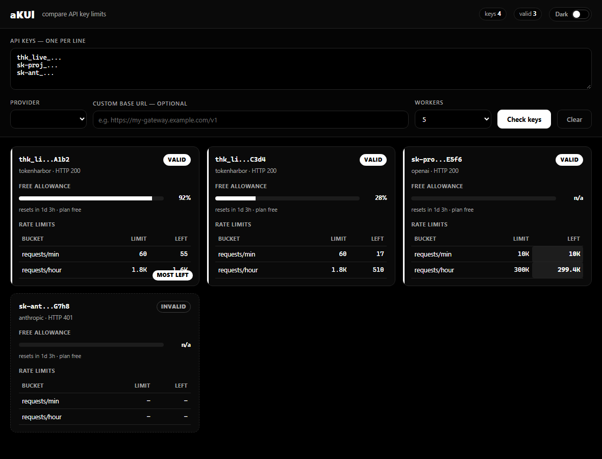
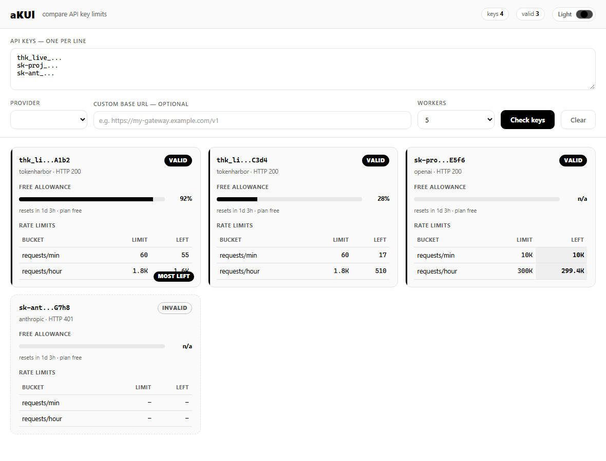

# keylimits / aKUl

A dependency-free Python CLI — and a Windows desktop app — that tell you **how
far you are into the limits of an API key**, and whether the key is valid at
all.

It works by making one minimal, cheap API call per key and then reading the
provider's rate-limit and quota response headers. No SDKs, no third-party
runtime packages.

```
KEYLIMITS  tokenharbor
──────────────────────────────────────────────────────────────
  Key      thk_li...ENAE
  Status   ✔ VALID   HTTP 200

Free allowance
  ██████████████████████████████  100% left
  resets in 5d 21h · plan free
  2026-10-02 22:02
  probed mimo-v2.5:free

Rate limits
Bucket                   Window                Limit  Remaining  Reset
───────────────────────  ────────────────────  ─────  ─────────  ─────
requests/min (account)   documented free tier  60     -          -
...
```

Colour and Unicode glyphs degrade automatically: on a non-TTY, under `NO_COLOR`,
or on a console that cannot encode the box characters, it falls back to plain
ASCII.

## Desktop app — aKUl

`aKUl` is a small Windows app for **comparing several keys side by side**.

| Dark | Light |
| --- | --- |
|  |  |

- Paste one key per line, pick a provider (or leave it on `auto`).
- Press **Check keys** — every key becomes a card showing validity, the free
  allowance bar with its reset countdown, and the rate-limit table.
- The key with the most quota left in any bucket is highlighted, so you can
  immediately see which key to use next.
- **Light / dark toggle** in the top-right; the choice is remembered. The theme
  is strictly monochrome — no coloured accents.
- **Custom base URL** lets you point any provider at a proxy, self-hosted
  gateway or regional endpoint (e.g. `https://gateway.internal/v1`).
- Keys are checked concurrently and never written to disk.

### Run it

Download `aKUl.exe` and double-click it — no Python needed. It binds a tiny
local HTTP server to `127.0.0.1` on an ephemeral port and renders the UI in a
pywebview window (needs the WebView2 runtime, preinstalled on Windows 11).

### Build it yourself

```bash
pip install pyinstaller pywebview
pyinstaller aKUl.spec --noconfirm
# -> dist/aKUl.exe  (~17 MB)
```

### Or run from source

```bash
pip install pywebview
python desktop/app.py
```

### Local API

The app serves a tiny JSON API that is handy for scripting:

| Route | Purpose |
| --- | --- |
| `GET /healthz` | readiness probe |
| `GET /api/providers` | provider list + env var names |
| `POST /api/check` | `{"text": "...", "provider": "auto", "base_url": "..."}` -> full comparison payload |

## Install (CLI)

Requires Python 3.9+. There are no runtime dependencies.

```bash
git clone <this-repo>
cd api-key-limits
pip install -e .
```

Or just run it in place without installing:

```bash
python -m keylimits --help
```

## Usage

```bash
# Auto-detect the provider from the key format
keylimits sk-...

# Pick a provider explicitly
keylimits --provider anthropic sk-ant-...

# Read a key from a known environment variable
OPENAI_API_KEY=sk-... keylimits --env

# Check many keys at once (one per line) and get JSON back
keylimits --file keys.txt --json

# Any endpoint that returns x-ratelimit-* headers
keylimits --provider generic \
  --url https://my-gateway.example.com/v1/models \
  --auth-header "x-api-key" --auth-scheme "" KEY
```

### Options

| Flag | Description |
| --- | --- |
| `-p, --provider` | `auto` (default), `openai`, `anthropic`, `groq`, `gemini`, `generic` |
| `--env` | Read the key from the provider's standard environment variable |
| `--file PATH` | Read one key per line (`#` comments allowed) |
| `--json` | Emit machine-readable JSON instead of a table |
| `--base-url URL` | Override the API base URL (proxies, self-hosted gateways) |
| `--timeout SECONDS` | Request timeout (default 30) |
| `--workers N` | Concurrency when checking multiple keys (default 5) |
| `--api-version V` | Anthropic API version header |
| `--model M` | Model used for the Token Harbor allowance probe (default: a `:free` model) |
| `--list-providers` | Print supported providers and their env vars |

Generic provider extras: `--url`, `--auth-header`, `--auth-scheme`, `--method`.

### Exit codes

| Code | Meaning |
| --- | --- |
| `0` | Every key is valid |
| `1` | At least one key is invalid |
| `2` | Bad usage / unknown provider |
| `3` | Result unknown (network failure, or a provider that hides limits) |

## Supported providers

| Name | Env var(s) | What it reports |
| --- | --- | --- |
| `openai` | `OPENAI_API_KEY` | requests/min + tokens/min limits, remaining and reset |
| `anthropic` | `ANTHROPIC_API_KEY` | unified request/token buckets |
| `groq` | `GROQ_API_KEY` | requests + tokens limits |
| `gemini` | `GEMINI_API_KEY`, `GOOGLE_API_KEY` | key validity (Gemini does not send limit headers) |
| `tokenharbor` | `TOKENHARBOR_API_KEY`, `TH_API_KEY` | key validity, free-allowance bar (% used + reset time), documented limits |
| `generic` | `API_KEY` | auto-scans any `x-ratelimit-*` header |

## Notes & limitations

- The probe call costs a fraction of a cent (1 token) on most providers.
- **Token Harbor** exposes the dashboard's free-allowance bar (used %, reset
  time, plan) only as response headers on an actual call, so `keylimits` issues
  one 1-token request to a `:free` model to read `X-Th-Free-Used-Pct`,
  `X-Th-Free-Resets` and `X-Th-Plan`. Override the probe model with `--model`.
  Free-model calls never charge the balance.
- Providers only return limit headers on real generation endpoints. If a
  provider does not send them, `keylimits` still reports key validity and says
  that limits were unavailable.
- Remaining values reflect **your account's** limit, which may be lower than the
  advertised tier limit.

## Library use

```python
from keylimits import check_key

result = check_key("sk-...", provider="auto")
print(result.valid)
for bucket in result.buckets:
    print(bucket.name, bucket.limit, bucket.remaining)
```

### Comparison helpers

```python
from keylimits.checker import check_many
from keylimits.comparison import build_comparison, serialize_key

keys = check_many(["sk-...", "sk-ant-..."], "auto")
data = build_comparison([serialize_key(k) for k in keys])
# data["winners"] -> {"requests": 0, "free allowance": 1, ...}
# data["valid_count"], data["bucket_names"]
```

## Tests

```bash
python -m unittest discover -s tests
# or, if installed with the dev extra
pytest
```

## Contributing a provider

Subclass `Provider` in `keylimits/providers/`, decorate it with `@register`, and
import it from `keylimits/providers/__init__.py`. See `groq.py` for a compact
example. If the provider exposes a quota bar (like Token Harbor's free
allowance), populate `KeyLimits.allowance` and the UI renders it automatically.

## License

MIT